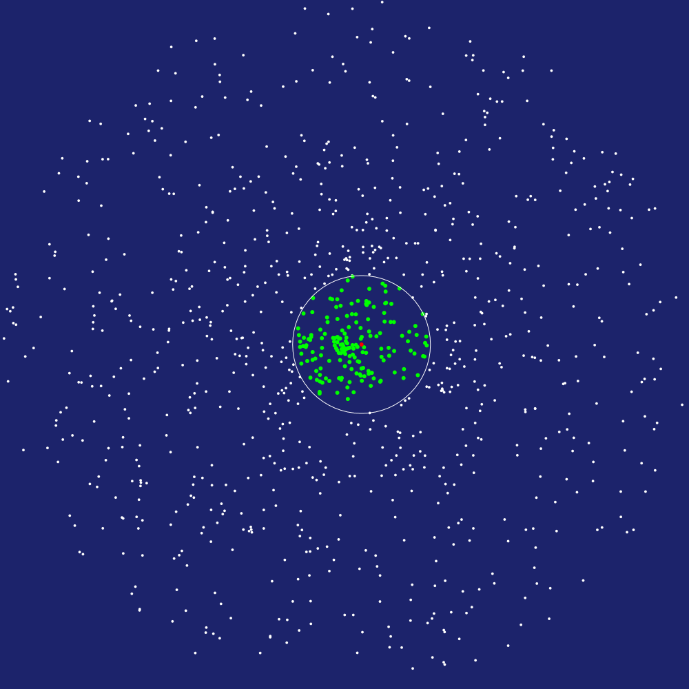
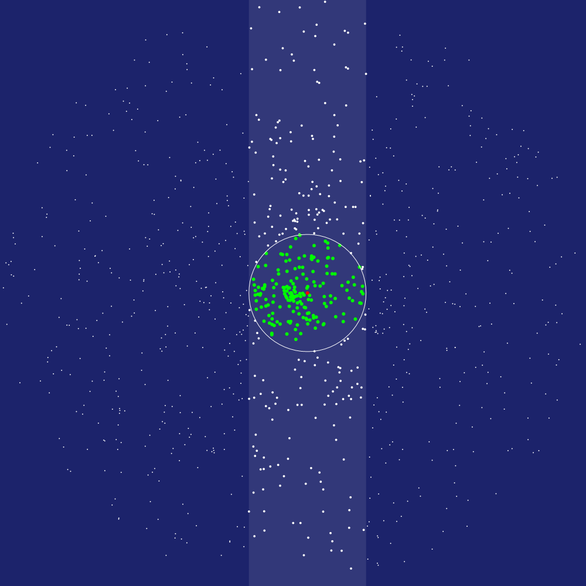
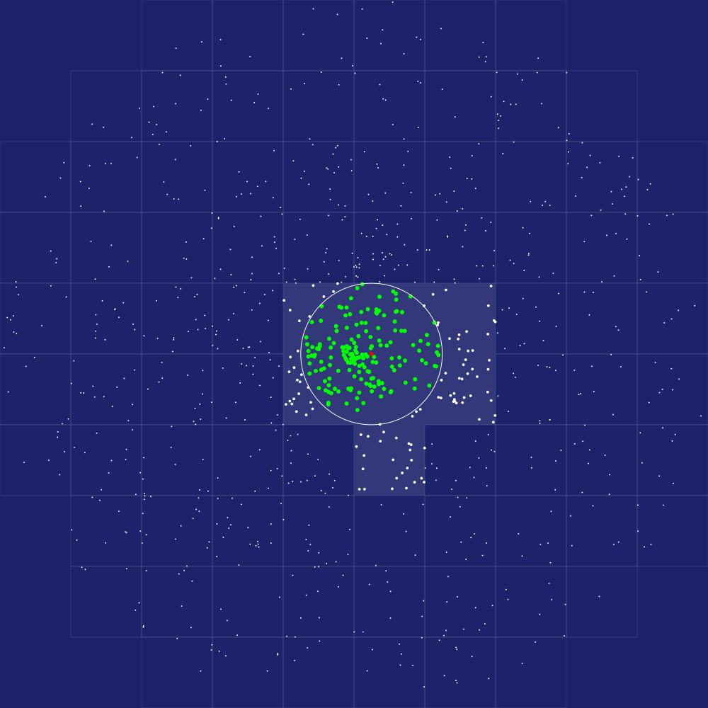
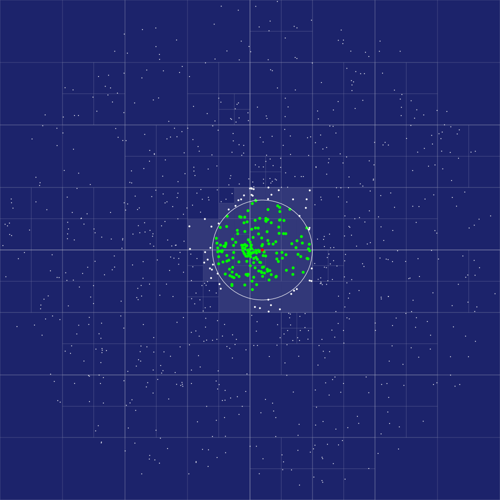
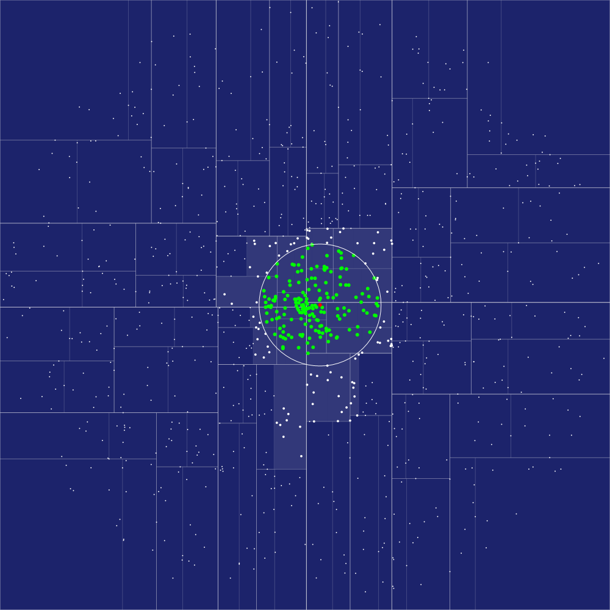

# Spatial data structures for Nim.

`nimble install spacy`


[API reference](https://nimdocs.com/treeform/spacy)

## About

Spatial algorithms are used to find the "closest" things faster than simple brute force iteration would. They make your code run faster using smarter data structures. This library has different "Spaces" that you can use to speed up games and graphical applications.

One key design decision is that all spaces have a very similar API and can be easily swapped. This way you can swap out spaces and see which one works best for your use case.

```nim
import spacy, vmath, random

var rand = initRand(2021)

# Create one of the BruteSpace, SortSpace, HashSpace, QuadSpace or KdSpace.
var space = newSortSpace()
for i in 0 ..< 1000:
  # All entries should have a id and pos.
  let e = Entry(id: i.uint32, pos: rand.randVec2())
  # Insert entries.
  space.insert e
# Call finalize to start using the space.
space.finalize()

# Iterate N x N entires and get the closest.
let distance = 0.001
for a in space.all():
  for b in space.findInRange(a, distance):
    echo a, " is close to ", b

# Clear the space when you are done.
space.clear()
```

### Perf time (1000 vs 1000 at 0.001 distance):
```
BruteSpace ......................... 1.839 ms      1.869 ms    ±0.052   x100
SortSpace .......................... 1.511 ms      1.539 ms    ±0.028   x100
HashSpace .......................... 0.441 ms      0.457 ms    ±0.022   x100
QuadSpace .......................... 0.185 ms      0.195 ms    ±0.010   x100
KdSpace ............................ 0.519 ms      0.548 ms    ±0.037   x100
```

You would usually pick the best one for your use case by profiling and tuning. There is a cost to generating each space, you need to make sure it justifies the lookup time savings.

# BruteSpace

BruteSpace is basically a brute force algorithm that takes every inserted element and compares to every other inserted element.



The BruteSpace is faster when there are few elements in the space or you don't do many look ups. It’s a good baseline space that enables you to see how slow things actually can be. Don't discount it! Linear scans are pretty fast when you are just zipping through memory. Brute force might be all you need!

# SortSpace

SortSpace is probably the simplest spatial algorithm you can have. All it does is sorts all entries on one axis. Here it does the X axis. Then all it does is looks to the right and the left for matches. It’s very simple to code and produces good results when the radius is really small.



You can see we are checking way less elements compared to BruteSpace. Instead of checking vs all elements we are only checking in the vertical slice.

SortSpace draws its power from the underlying sorting algorithm n×log(n) nature. It’s really good for very small distances when you don’t expect many elements to appear in the vertical slice. SortSpace is really good at cache locality because you are searching things next to each other and are walking linearly in memory.

# HashSpace

HashSpace is a little more complex than SortSpace but it’s still pretty simple. Instead of drawing its power from a sorting algorithm it draws its power from hash tables. HashSpace has a resolution and every entry going in is put into a grid-bucket. To check for surrounding entries you simply look up closest grid buckets and then loop through their entries.



HashSpaces are really good for when your entries are uniformly distributed with even density and things can’t really bunch up too much. They work even better when entries are really far apart. They are also really good when you are always searching the same distance in that you can make the grid size match your search radius. You can tune this space for your usecase.

# QuadSpace

QuadSpace is basically the same as "quad tree" (I just like the space theme). Quad trees are a little harder to make but usually winners in all kinds of spatial applications. They work by starting out with a single quad and as more elements are inserted into the quad they hit maximum elements in a quad and split into 4. The elements are redistributed. As those inner quads begin to fill up they are split as well. When looking up stuff you just have to walk into the closets quads.



QuadSpaces are really good at almost everything. But they might miss out in some niche cases where SortSpaces (really small distances) or HashSpaces (uniform density) might win out. They are also bad at cache locality as many pointers or references might make you jump all over the place in memory.

# KdSpace

Just like QuadSpace is about Quad Trees, KdSpace is about kd-tree. Kd-Trees differ from quad trees in that they are binary and they sort their results as they divide. Potentially getting less nodes and less bounds to check. Quad trees build their nodes as new elements are inserted while kd-trees build all the nodes in one big final step.



KdSpace trees take a long time to build. In theory KdSpace would be good when the entries are static, the tree is built once and used often. While QuadSpace might be better when the tree is rebuilt all the time.

# Always be profiling.

You can’t really say one Space is faster than the others, you always need to check. The hardware or your particular problem might drastically change the speed characteristics. This is why all spaces have a similar API and you can just swap them out when another space seems better for your use case.

# API: spacy

```nim
import spacy
```

## **type** Entry


```nim
Entry = object
 id*: uint32
 pos*: Vec2
```

## **type** BruteSpace

Brute-force space just compares every entry vs every other entry. Supposed to be good for very small number or large ranges.

```nim
BruteSpace = ref object
 list*: seq[Entry]
```

## **proc** newBruteSpace

Creates a new brute-force space.

```nim
proc newBruteSpace(): BruteSpace
```

## **proc** insert

Adds entry to the space.

```nim
proc insert(bs: BruteSpace; e: Entry) {.inline.}
```

## **proc** finalize

Finishes the space and makes it ready for use.

```nim
proc finalize(bs: BruteSpace) {.inline.}
```

## **proc** clear

Clears the spaces and makes it ready to be used again.

```nim
proc clear(bs: BruteSpace) {.inline.}
```

## **proc** len

Number of entries inserted

```nim
proc len(bs: BruteSpace): int {.inline.}
```

## **iterator** all

Iterates all entries in a space.

```nim
iterator all(bs: BruteSpace): Entry
```

## **iterator** findInRangeApprox

Iterates all entries in range of an entry but does not cull them. Useful if you need distance anyways and will compute other computations.

```nim
iterator findInRangeApprox(bs: BruteSpace; e: Entry; radius: float): Entry
```

## **iterator** findInRange

Iterates all entries in range of an entry.

```nim
iterator findInRange(bs: BruteSpace; e: Entry; radius: float): Entry
```

## **type** SortSpace

Sort space sorts all entires on one axis X. Supposed to be good for very small ranges.

```nim
SortSpace = ref object
 list*: seq[Entry]
```

## **proc** newSortSpace

Creates a new sorted space.

```nim
proc newSortSpace(): SortSpace
```

## **proc** insert

Adds entry to the space.

```nim
proc insert(ss: SortSpace; e: Entry) {.inline.}
```

## **proc** finalize

Finishes the space and makes it ready for use.

```nim
proc finalize(ss: SortSpace) {.inline.}
```

## **proc** clear

Clears the spaces and makes it ready to be used again.

```nim
proc clear(ss: SortSpace) {.inline.}
```

## **proc** len

Number of entries inserted.

```nim
proc len(ss: SortSpace): int {.inline.}
```

## **iterator** all

Iterates all entries in a space.

```nim
iterator all(ss: SortSpace): Entry
```

## **iterator** findInRangeApprox

Iterates all entries in range of an entry but does not cull them. Useful if you need distance anyways and will compute other computations.

```nim
iterator findInRangeApprox(ss: SortSpace; e: Entry; radius: float): Entry
```

## **iterator** findInRange

Iterates all entries in range of an entry.

```nim
iterator findInRange(ss: SortSpace; e: Entry; radius: float): Entry
```

## **type** HashSpace

Divides space into little tiles that objects are hashed too. Supposed to be good for very uniform filled space.

```nim
HashSpace = ref object
 hash*: TableRef[(int32, int32), seq[Entry]]
 resolution*: float
```

## **proc** newHashSpace

Creates a hash table space.

```nim
proc newHashSpace(resolution: float): HashSpace
```

## **proc** insert

Adds entry to the space.

```nim
proc insert(hs: HashSpace; e: Entry) {.raises: [KeyError].}
```

## **proc** finalize

Finishes the space and makes it ready for use.

```nim
proc finalize(hs: HashSpace) {.inline.}
```

## **proc** clear

Clears the spaces and makes it ready to be used again.

```nim
proc clear(hs: HashSpace) {.inline.}
```

## **proc** len

Number of entries inserted

```nim
proc len(hs: HashSpace): int {.inline.}
```

## **iterator** all

Iterates all entries in a space.

```nim
iterator all(hs: HashSpace): Entry
```

## **iterator** findInRangeApprox

Iterates all entries in range of an entry but does not cull them. Useful if you need distance anyways and will compute other computations.

```nim
iterator findInRangeApprox(hs: HashSpace; e: Entry; radius: float): Entry {.raises: [KeyError].}
```

## **iterator** findInRange

Iterates all entries in range of an entry.

```nim
iterator findInRange(hs: HashSpace; e: Entry; radius: float): Entry {.raises: [KeyError].}
```

## **type** QuadSpace

QuadTree, divide each node down if there is many elements. Supposed to be for large amount of entries.

```nim
QuadSpace = ref object
 root*: QuadNode
 maxThings*: int
 maxLevels*: int
```

## **type** QuadNode


```nim
QuadNode = ref object
 things*: seq[Entry]
 nodes*: seq[QuadNode]
 bounds*: Rect
 level*: int
```

## **proc** newQuadSpace

Creates a new quad-tree space.

```nim
proc newQuadSpace(bounds: Rect; maxThings = 10; maxLevels = 10): QuadSpace
```

## **proc** insert


```nim
proc insert(qs: QuadSpace; qn: var QuadNode; e: Entry) {.raises: [Exception], tags: [RootEffect].}
```

## **proc** insert

Adds entry to the space.

```nim
proc insert(qs: QuadSpace; e: Entry) {.raises: [Exception], tags: [RootEffect].}
```

## **proc** finalize

Finishes the space and makes it ready for use.

```nim
proc finalize(qs: QuadSpace) {.inline.}
```

## **proc** clear

Clears the spaces and makes it ready to be used again.

```nim
proc clear(qs: QuadSpace) {.inline.}
```

## **proc** len

Number of entries inserted.

```nim
proc len(qs: QuadSpace): int {.inline.}
```

## **iterator** all

Iterates all entries in a space.

```nim
iterator all(qs: QuadSpace): Entry
```

## **iterator** findInRangeApprox

Iterates all entries in range of an entry but does not cull them. Useful if you need distance anyways and will compute other computations.

```nim
iterator findInRangeApprox(qs: QuadSpace; e: Entry; radius: float): Entry
```

## **iterator** findInRange

Iterates all entries in range of an entry.

```nim
iterator findInRange(qs: QuadSpace; e: Entry; radius: float): Entry
```

## **type** KdSpace

KD-Tree, each cell is divided vertically or horizontally. Supposed to be good for large amount of entries.

```nim
KdSpace = ref object
 root*: KdNode
 maxThings*: int
```

## **type** KdNode


```nim
KdNode = ref object
 things*: seq[Entry]
 nodes*: seq[KdNode]
 bounds*: Rect
 level*: int
```

## **proc** newKdSpace

Creates a new space based on kd-tree.

```nim
proc newKdSpace(bounds: Rect; maxThings = 10; maxLevels = 10): KdSpace
```

## **proc** insert

Adds entry to the space.

```nim
proc insert(ks: KdSpace; e: Entry) {.inline.}
```

## **proc** finalize

Finishes the space and makes it ready for use.

```nim
proc finalize(ks: KdSpace)
```

## **proc** clear

Clears the spaces and makes it ready to be used again.

```nim
proc clear(ks: KdSpace) {.inline.}
```

## **proc** len

Number of entries inserted.

```nim
proc len(ks: KdSpace): int
```

## **iterator** all

Iterates all entries in a space.

```nim
iterator all(ks: KdSpace): Entry
```

## **iterator** findInRangeApprox

Iterates all entries in range of an entry but does not cull them. Useful if you need distance anyways and will compute other computations.

```nim
iterator findInRangeApprox(ks: KdSpace; e: Entry; radius: float): Entry
```

## **iterator** findInRange

Iterates all entries in range of an entry.

```nim
iterator findInRange(ks: KdSpace; e: Entry; radius: float): Entry
```
